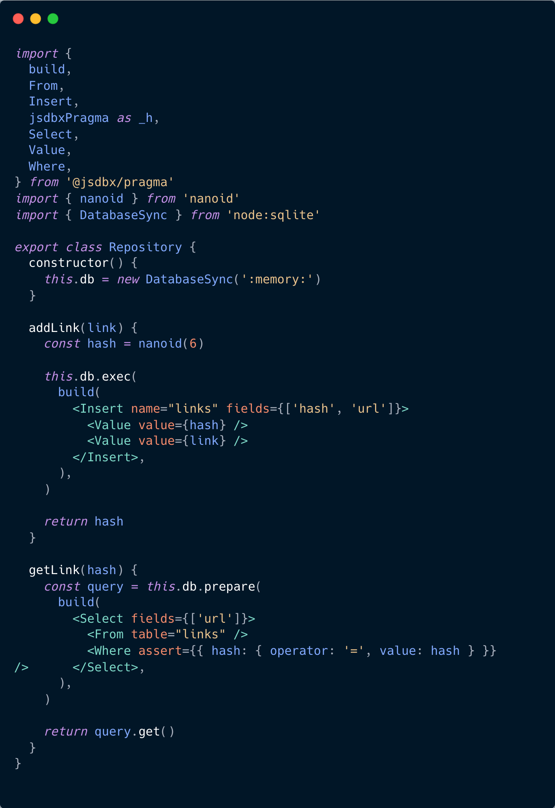

# jsdbx

[Demo](https://dlinks.ru)
[Документация на русском](../README.md)



What if `SQL` queries could be written as if you were writing `React` components?

## Description

This is a joke project and a demonstration of possibilities; don't take this joke too seriously.
The project implements pragma and a component library for building `SQL` queries on top of `Babel` and `@babel/plugin-transform-react-jsx`.

## Example

For example, consider the file `repository.tsx` from `./apps/server/src`.

```jsx
import { build, CreateTable, Field, jsdbxPragma as _h } from '@jsdbx/pragma'

db.exec(
  build(
    <CreateTable name="links" ifNotExists>
      <Field name="hash" type="TEXT" constraints={['PRIMARY KEY']} />
      <Field name="url" type="TEXT" constraints={['NOT NULL']} />
    </CreateTable>
  )
)
```

The components are converted into a tree from which the `build` utility assembles the final request.
Importing `jsdbxPragma` is necessary for correct substitution and function calls after transpilation.

## Installation and running locally

First, you need to install the dependencies:

```shell
yarn install
```

Next, you need to compile the `pragma` package and the `server` application:

```shell
yarn workspace @jsdbx/pragma build
yarn workspace @jsdbx/server build
```

Next, you need to run the `web` application:

```shell
yarn workspace @jsdbx/web build
```

## Launching in production mode

To launch in production mode, simply assemble and run the Docker image, specifying the application domain in the variable:

```shell
docker build --build-arg VITE_PUBLIC_HOST=$HOST .
docker run -p 3000:3000 $HASH
```